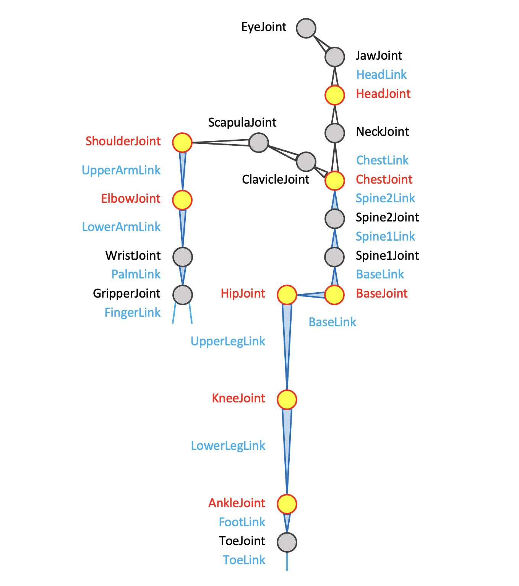

<h3> JointとLinkの対応表 </h3>  

 
<h4><b>MeridianのURDFのJoint名,Link名と各CG系ソフトでの名称との対応表</b></h4>  
CG系ソフトでは関節は球体関節とみなす.  
Meridianでは各軸とも最大3軸を持つ想定. ロール, ピッチ, ヨーの順番や選択は機体毎に設定.  
スライダタイプのアクチュエータは別途linkに設定.  

|Meridian(joint)|Meridian(link)|骨の名称|Unity/VRM|Blender|UE4|
|:----|:----|:----------|:----|:-|:----|
|c_basejoint|celvis|骨盤|Hips|Hips|pelvis|
|l_hipjoint|l_upperleg|股関節| | | |
|l_upperlegjoint|l_upperleg|左大腿骨|LeftUpperLeg|Left leg|thigh_l|
|l_kneejoint|l_knee|左膝| | | |
|l_lowerlegjoint|l_lowerleg|左脛骨|LeftLowerLeg|Left knee|calf_l|
|l_anklejoint|l_ankle|左踵| | | |
|l_footjoint|l_foot|左足・足根骨|LeftFoot|Left ankle|foot_l|
|l_toejoint|l_toe|左つま先・趾骨|LeftToes|Left toe|ball_l|
| | |　　| | | |
|c_spine1joint|c_spine1|背骨1|Spine|Spine|spline_01|
|c_spine2joint|c_spine2|背骨2| | |spline_02|
|c_chestjoint|c_chest|胸部|Chest|Chest|spline_03|
| | |　　| | | |
|l_eyejoint|l_eye|左目|LeftEye| | |
|c_headjoint|c_head|頭|Head|Head|head|
|c_neckjoint|c_neck|首|Neck|Neck|neck_01|
|c_jawjoint|c_jaw|顎|Jaw| | |
| | |　　| | | |
|l_scapulajoint|l_scapula|肩甲骨部|UpperChest|Upper Chest| |
|l_claviclejoint|l_clavicle|左鎖骨| | | |
|l_shoulderjoint|l_shoulder|左肩|LeftShoulder|Left shoulder|clavicle_l|
|l_upperarmjoint|l_upperarm|左上腕|LeftUpperArm|Left arm|upperarm_l|
|l_elbowjoint|l_elbow|左肘| | | |
|l_lowerarmjoint|l_lowerarm|左下腕|LeftLowerArm|Left elbow|lowerarm_l|
|l_wrist|l_wrist|左手首|LeftHand|Left wrist|hand_l|
|lalm|l_hand/palm|左手| | | |
|l_gripperjoint1|l_gripper1|左グリッパー1| | | |
| | |　　| | | |
|l_thumbjoint_1mp|l_thumb_1prox|左親指骨基節|LeftThumbProximal|Thumb0_L|thumb_01_l|
|l_thumbjoint_2pip|l_thumb_2mid|左親指骨中節|LeftThumbIntermediate|Thumb1_L|thumb_02_l|
|l_thumbjoint_3dip|l_thumb_3dis|左親指骨末節|LeftThumbDistal|Thumb2_L|thumb_03_l|
|l_indexjoint_1mp|l_index_1prox|左人差し指骨基節|LeftIndexProximal|IndexFinger1_L|index_01_l|
|l_indexjoint_2pip|l_index_2mid|左人差し指骨中節|LeftIndexIntermediate|IndexFinger2_L|index_02_l|
|l_indexjoint_3dip|l_tindex_3dis|左人差し指骨末節|LeftIndexDistal|IndexFinger3_L|index_03_l|
|l_middlejoint_1mp|l_middle_1prox|左中指骨基節|LeftMiddleProximal|MiddleFinger1_L|middle_01_l|
|l_middlejoint_2pip|l_middle_2mid|左中指骨中節|LeftMiddleIntermediate|MiddleFinger2_L|middle_02_l|
|l_middlejoint_3dip|l_middle_3dis|左中指骨末節|LeftMiddleDistal|MiddleFinger3_L|middle_03_l|
|lingjoint_1mp|ling_1prox|左薬指骨基節|LeftRingProximal|RingFinger1_L|ring_01_l|
|lingjoint_2pip|ling_2mid|左薬指骨中節|LeftRingIntermediate|RingFinger2_L|ring_02_l|
|lingjoint_3dip|ling_3dis|左薬指骨末節|LeftRingDistal|RingFinger3_L|ring_03_l|
|l_littlejoint_1mp|l_little_1prox|左小指骨基節|LeftLittleProximal|LittleFinger1_L|pinky_01_l|
|l_littlejoint_2pip|l_little_2mid|左小指骨中節|LeftLittleIntermediate|LittleFinger2_L|pinky_02_l|
|l_littlejoint_3dip|l_little_3dis|左小指骨末節|LeftLittleDistal|LittleFinger3_L|pinky_03_l|
  
赤文字は多くのヒューマノイドで使用されている基本的なジョイント.  

